# The Gambia, Visit The Smiling Coast.

Visit The Smiling Coast, is a site to learn about The Gambia, smallest country in West Africa. 
The site is for people that want to know about The Gambia, it's people and culture. Visit The Smiling Coast,
will be useful for people that want to travel to Gambia, move to The Gambia or just curious about The smallest
country in West Africa that is given the name SMILING COAST OF AFRICA.

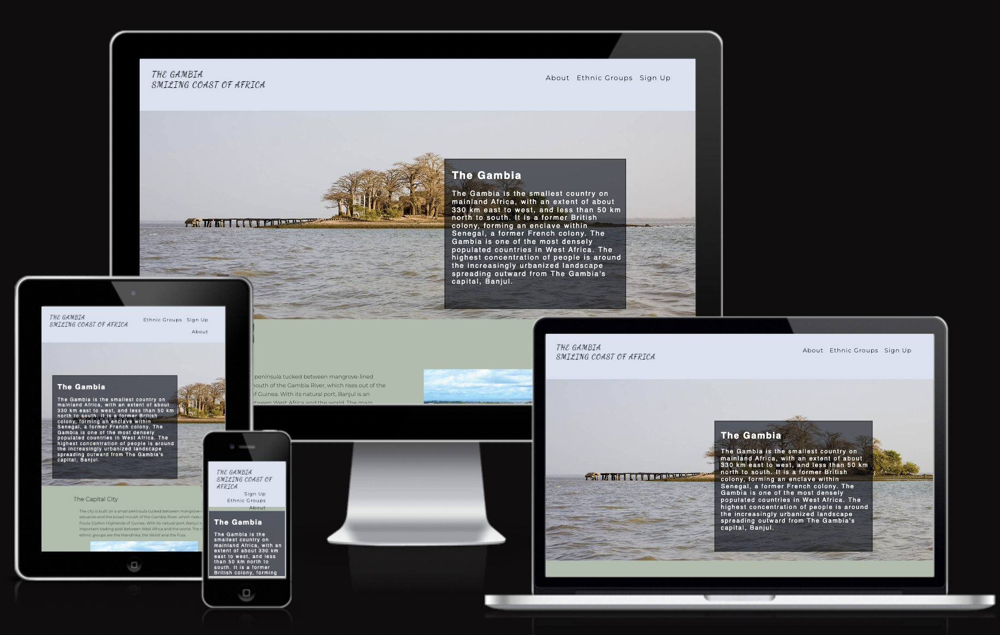

# UX Development
## Project Goal

The website goal is to promote about The Gambia, the beautiful ethnic groups, tourism in the country and so on.

## Target Audience

* Travelers, Tourist, Returnees, Students.

# Design

## Colour Scheme
The colour was inspired by the nature and ocean in The Gambia, Green - NATURE, Blue - OCEAN, White - PEACE.
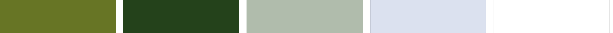
Color was created using [Muzli colors](https://colors.muz.li/)

## Imagery
The photos featured throughout the page were obtain from family and free image providers such as [Pexels](https://www.pexels.com/)

## Videos
The videos feetured throughout the site were obtain from [Youtube](https://www.youtube.com/)

## Wireframe
The wireframes were produce using [Wireframepro](https://wireframepro.mockflow.com/)

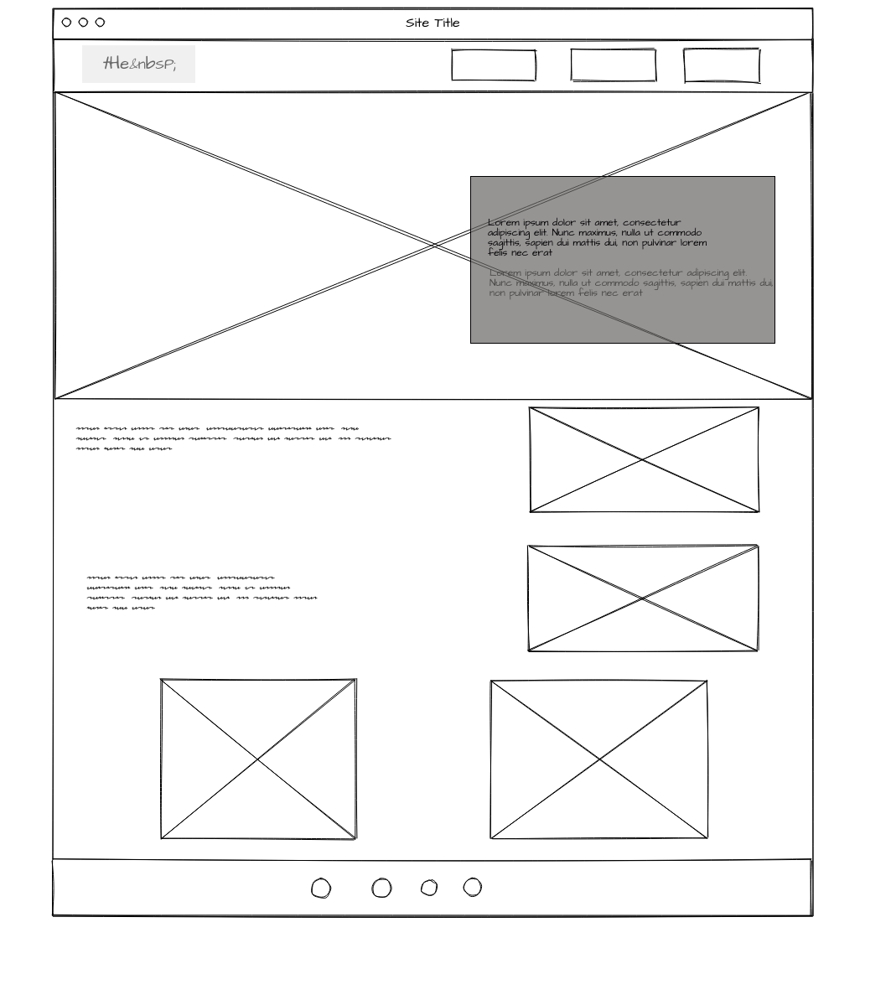

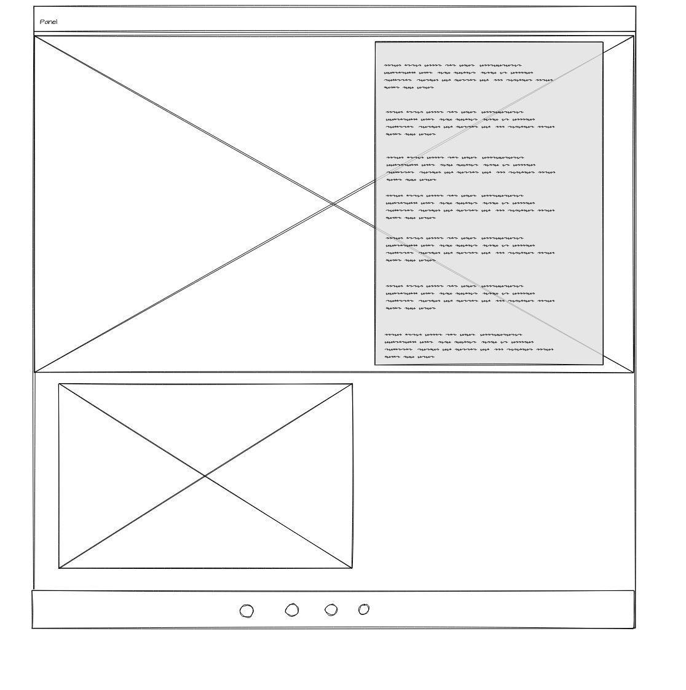

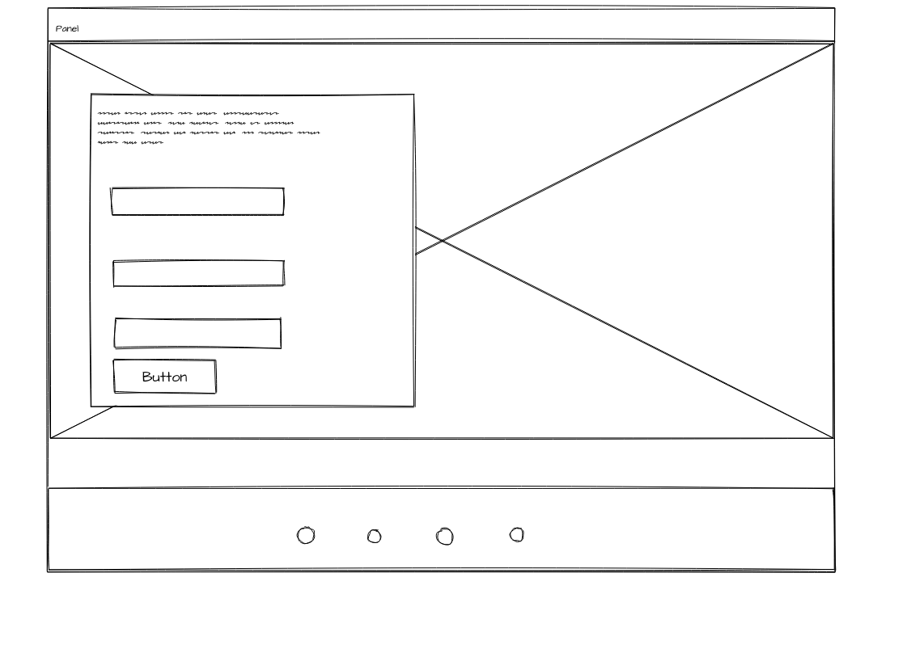

 

# Features

## Navigation Bar
* The navigation bar is responsive and fixed at the top of the page where it shows the logo and name on the right.
* The navigation links on the right take the user to different sections on the same page.
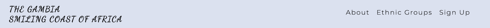

## The landing page image
* The page include an image of Jame Island a historic site in The Gambia and text overly for users to see a littl description about The Gambia.

## Feature Section

* It tells more about the Gambia, the capital city Banjul, Gambias economy and Tourism and it saws beautiful picture of Banjul and Agriculture and Tourist place Makasutu.

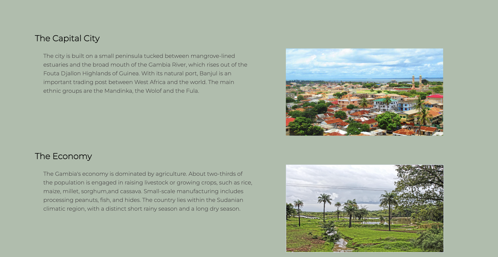

## Videos

* The first video is a song about The Gambia it is sang in Mandinka Languege and and The second video is fun facts about the Gambia, brief description and the videos are there to make the users understand more about the country. The second video is choosen because it is a very fun way to learn about a country without being bored. The videos are from [Youtube](https://www.youtube.com/).

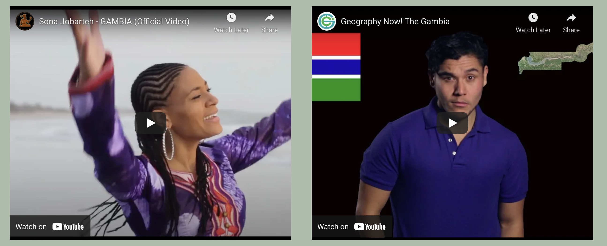

## Ethnic Groups

* The page includes image of different ethnic groups together dancing and text overly for users to see the largest ethnic group in The Gambia and there are links to learn more about the ethnic group.

## Video about Ethnic Groups in The Gambia

* The video is for users to learn more ethnic groups in The Gambia in a fun way and not get bored, the video is from [Youtube](https://www.youtube.com/).

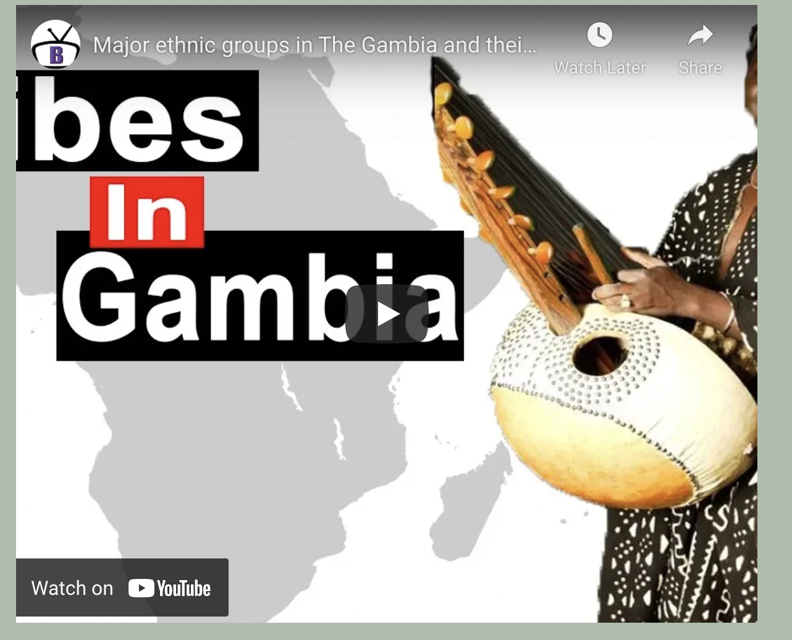

## Newsletter

* The site will be sending newsletter to users about things to do in The Gambia and other exciting things about The Gambia.
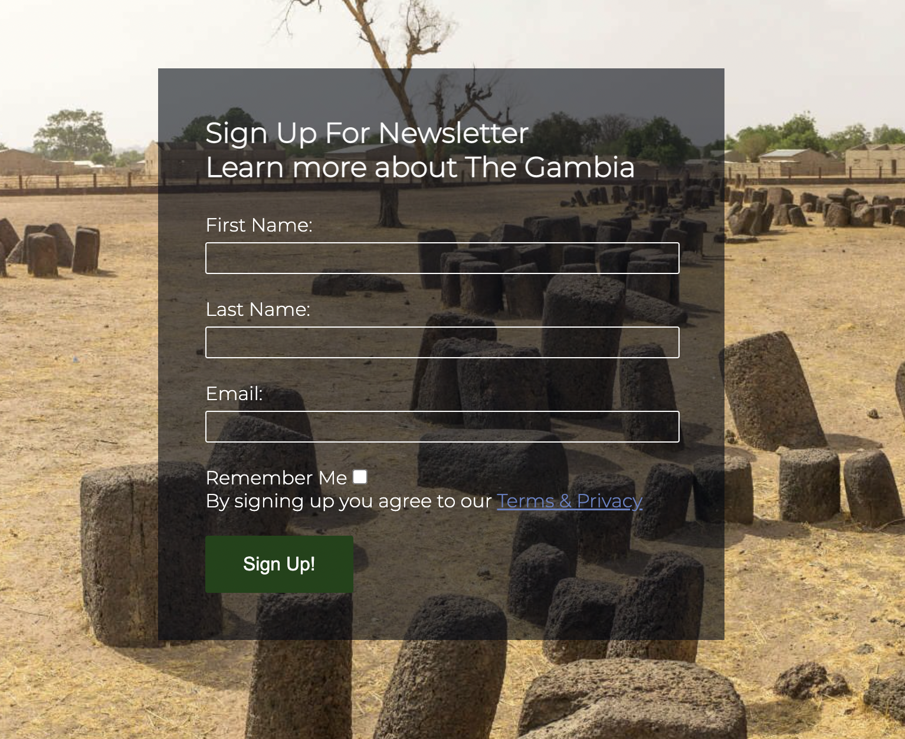

## Footer 
* The users can visit us on our social media sites

 

# Languages Used
* HTML and CSS were used to create this website

# Frameworks, Libraries & Programs Used
* [Wireframepro](https://wireframepro.mockflow.com/): For Wireframe.
* [Muzli colors](https://colors.muz.li/): For choosing colours and colour inspiration.
* [Font Awesome](https://fontawesome.com/): For icons used in the site.
* [Google Fonts](https://fonts.google.com/): For different font style.
* [Chrome Dev Tools](https://developer.chrome.com/docs/devtools/): Used extensively to experiment with grid and general responsiveness.
* [Gitpod](https://gitpod.io/workspaces): Used to create and host the website.
* [Github](https://github.com/): Used to deploy the website.
* [Am I responsive](https://ui.dev/amiresponsive): To create an image displaying the home page on various devices.

# Deployment
This site was disployed to Github pages.

## Steps to deploye
* Navigate to the settings tab in the GitHub repository
* Once in settings, navigate to the pages tab on the left of the page
* Under source, select branch ‘master’ and then click ‘save’
* Page will no automatically refresh and show a detailed ribbon display to indicate deployment

# Test
## Code Validation

## W3C HTML Validator
Index.html Page

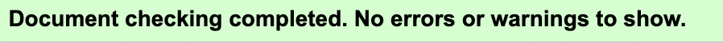

 

Ethnic-groups.html

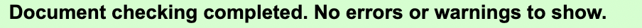

 

Signup.html

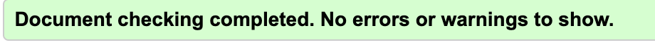

 

CSS

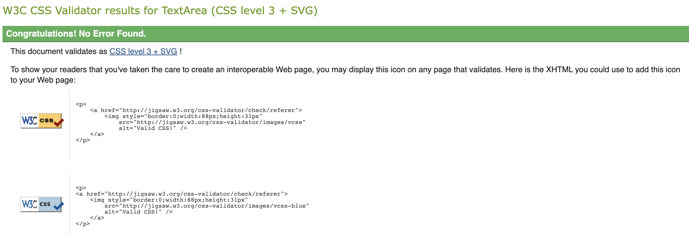

 

# Lighthouse

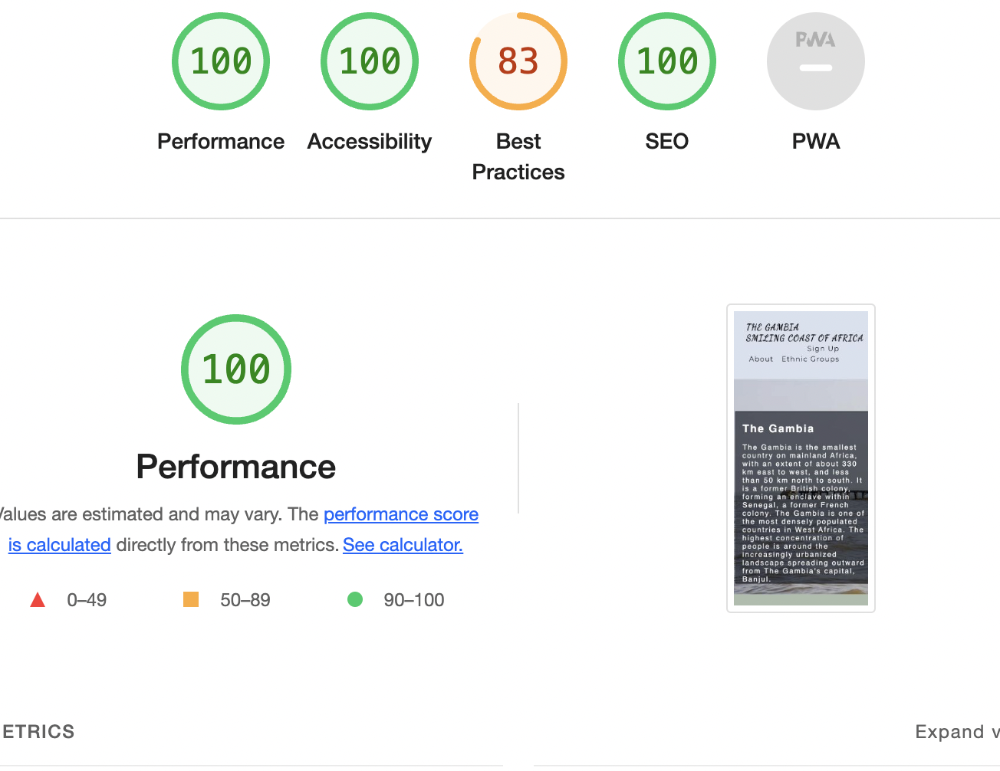

 

# Bugs 

## Unresolve

* I had a lot of problem with media query, I wanted to make the navigation to go all vertical when when on a phone size but I couldn't.

